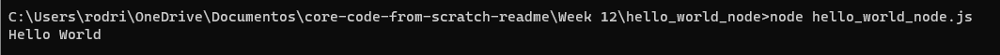

# Thuesday February 14, 2023

## Node.JS Core Understanding
### What is NodeJS?

As an asynchronous event-driven JavaScript runtime, Node.js is designed to build scalable network applications. In the following "hello world" example, many connections can be handled concurrently. Upon each connection, the callback is fired, but if there is no work to be done, Node.js will sleep.

#### What is NPM?

NPM is lots of things.

- NPM is the package manager for Node.js. It was created in 2009 as an open source project to help JavaScript developers easily share packaged modules of code.

- The NPM Registry is a public collection of packages of open-source code for Node.js, front-end web apps, mobile apps, robots, routers, and countless other needs of the JavaScript community.

- NPM is the command line client that allows developers to install and publish those packages.

### What problem does Node.JS solve (Is there any problem that can be solved with Node.JS 🤔)?

Node.js is a JavaScript runtime environment that enables developers to use JavaScript for both server-side and client-side programming. One of the primary problems that Node.js solves is the ability to create highly scalable, real-time applications that can handle a large number of simultaneous connections.

With Node.js, developers can create highly scalable, real-time applications that can handle a large number of simultaneous connections. Node.js achieves this by using an event-driven, non-blocking I/O model that enables it to handle multiple connections without blocking any of them. This means that Node.js applications can handle thousands of connections simultaneously, making them ideal for building applications such as chat rooms, real-time analytics, and multiplayer games.

In addition, Node.js also provides a rich set of built-in modules and tools, making it easy for developers to build and deploy applications quickly. Node.js is also highly extensible, with a large and active community that has developed a wide range of third-party modules and tools that can be used to enhance its capabilities.

### What is the V8 Javascript Engine?

The V8 JavaScript Engine is an open-source, high-performance JavaScript engine that was developed by Google to power their Chrome web browser. It is designed to execute JavaScript code quickly and efficiently by compiling it into optimized machine code.

In addition to its speed, the V8 engine also includes a number of features designed to improve the performance of JavaScript code. For example, it uses a technique called hidden classes to optimize object creation and property access, and it includes a garbage collector that automatically manages memory to prevent memory leaks.

### Is Node.JS really necessary in the Development ecosystem?

Node.js is not strictly necessary in the development ecosystem, but it provides a number of benefits that make it a valuable tool for many developers.

One of the key benefits of Node.js is that it allows developers to use JavaScript for both server-side and client-side programming. This means that developers can use a single language throughout the entire development stack, which can help simplify the development process and reduce the learning curve for developers who are already familiar with JavaScript.

In addition, Node.js provides a number of features that are specifically designed for server-side programming, such as a built-in HTTP server, support for WebSockets and other real-time communication protocols, and access to the file system and other system resources. This makes it well-suited for developing server-side applications, such as web servers, APIs, and real-time applications.

Another benefit of Node.js is its large and active community of developers, which has developed a wide range of third-party modules and tools that can be used to enhance its capabilities. This includes modules for everything from database access and authentication to web frameworks and build tools.

Overall, while Node.js is not strictly necessary in the development ecosystem, it provides a number of benefits that make it a valuable tool for many developers, particularly those who are building real-time or server-side applications.

#### Why not use PHP or Golang?

PHP and Golang are both popular programming languages that can be used to develop server-side applications, and they have their own unique advantages and disadvantages.

PHP is a mature language that has been used for server-side development for many years, and it has a large and active community of developers who have developed a wide range of tools and frameworks for it. PHP is well-suited for web development and is particularly popular for building content management systems (CMS) and e-commerce websites.

However, PHP has some limitations. For example, it is not well-suited for real-time applications that require a large number of concurrent connections, as it relies on a traditional synchronous programming model. It is also not as flexible as Node.js when it comes to handling non-HTTP protocols, such as WebSockets.

Golang, on the other hand, is a relatively new language that was developed by Google, and it is designed to be fast, efficient, and scalable. Golang is well-suited for building high-performance applications, particularly those that require concurrency and parallelism.

However, Golang has a steeper learning curve than PHP or Node.js, and it is not as well-suited for web development as PHP. It also does not have as large of a community or ecosystem of tools and frameworks as PHP or Node.js.

### What is the difference between Node.JS and any other browser?

Node.js is not a browser, but rather a JavaScript runtime environment that allows JavaScript code to be executed outside of a browser environment. While browsers also execute JavaScript code, they do so in a different way and have different capabilities compared to Node.js.

Browsers are designed to interpret and execute JavaScript code within the context of a web page or web application. Browsers provide a number of APIs and features that are specific to web development, such as the Document Object Model (DOM) and support for handling user input and events. Browsers also provide a sandboxed environment that restricts the access of JavaScript code to the user's system resources, such as the file system.

Node.js, on the other hand, is designed to execute JavaScript code outside of a browser environment, such as on a server or in a command-line interface. Node.js provides a number of features that are specific to server-side programming, such as a built-in HTTP server and access to the file system and other system resources. Node.js also provides a module system that allows developers to easily reuse and share code, and it has a large and active community that has developed a wide range of third-party modules and tools.

Overall, while both browsers and Node.js can execute JavaScript code, they have different capabilities and are designed for different purposes. Browsers are designed for web development, while Node.js is designed for server-side programming and command-line interfaces.

#### Are Node.JS and a browser the same?

No, Node.js and a browser are not the same. While both can run JavaScript code, they have different purposes and operate in different environments.

A browser is a software application that is used to access and display web pages and web applications. Browsers are designed to interpret and execute JavaScript code within the context of a web page or web application. Browsers provide a number of APIs and features that are specific to web development, such as the Document Object Model (DOM) and support for handling user input and events. Browsers also provide a sandboxed environment that restricts the access of JavaScript code to the user's system resources, such as the file system.

### What is NVM and Why is it useful for Node.JS developers?

NVM (Node Version Manager) is a command-line tool that allows Node.js developers to easily manage multiple versions of Node.js on a single machine. With NVM, developers can easily switch between different versions of Node.js and ensure that their projects are running on the correct version.

NVM provides a simple and convenient way to install, remove, and switch between different versions of Node.js. NVM allows developers to install multiple versions of Node.js side-by-side, and provides a simple command to switch between them. This is particularly useful for developers who work on multiple projects that require different versions of Node.js.

NVM also provides a way to manage global and local packages for each version of Node.js. This means that developers can easily install and manage packages for each version of Node.js, without worrying about conflicts or dependencies.

Overall, NVM is a useful tool for Node.js developers because it simplifies the process of managing multiple versions of Node.js and makes it easy to switch between them. This can help to ensure that projects are running on the correct version of Node.js and that package dependencies are managed correctly.

---

## Node.JS Module System Core Understanding

### What is a Javascript Module?

In JavaScript, a module is a self-contained block of code that can be reused and imported into other code files. Modules help to organize code and make it more maintainable and reusable.

A JavaScript module typically consists of a set of functions, objects, or variables that are grouped together and exported from the module. The exported functions, objects, or variables can then be imported into other JavaScript files where they are needed.

### Why are Javascript Modules necessary?

1. Code organization and maintainability: Modules allow developers to organize code into smaller, more manageable units. This makes it easier to maintain and update code, and helps to prevent naming collisions and other issues that can arise when code is not well-organized.

2. Reusability: Modules can be reused in multiple places within an application, or even across different applications. This can save time and effort for developers, and can help to ensure consistency and quality across different parts of an application.

3. Dependency management: Modules can be used to manage dependencies between different parts of an application. For example, a module might depend on another module to provide a certain functionality or service. By using modules, developers can ensure that all dependencies are properly managed and that the application is able to function as intended.

4. Encapsulation: Modules provide a way to encapsulate code and prevent it from interfering with other parts of an application. This can help to improve security and prevent bugs and other issues from arising.

### What module standards are available in Node.JS?

- CommonJS: CommonJS is the original module standard used by Node.js, and it defines a simple way to define and use modules in JavaScript. In CommonJS, modules are defined using the module.exports and require keywords.

- ES6 Modules: ES6 modules are a newer module standard that is now supported by Node.js. In ES6 modules, modules are defined using the export and import keywords.

- AMD: AMD (Asynchronous Module Definition) is a module standard used primarily in web browsers. It is similar to CommonJS, but it is designed to support asynchronous loading of modules in web applications.

Node.js also supports several module loaders, including the Node.js native module loader and third-party loaders like Browserify and Webpack. These loaders provide additional features and functionality for managing modules in Node.js applications.

### What are the differences between ESModules and CommonJS modules?

ESModules and CommonJS modules are two different module systems used in JavaScript, each with their own syntax and functionality.

1. Syntax: ESModules use the import and export keywords to define and use modules, while CommonJS uses the require() function and module.exports or exports objects.

2. Static vs. Dynamic: ESModules are statically analyzed at compile-time, which means that the dependencies are resolved before the code is executed. In contrast, CommonJS modules are dynamically loaded at runtime, which means that the dependencies are resolved when the code is executed.

3. Browser Support: ESModules are natively supported in modern web browsers, while CommonJS modules are not. However, CommonJS modules can be used in the browser with the help of tools like Browserify or Webpack.

4. Default Export: ESModules have a default export syntax, which allows developers to export a single value from a module. In CommonJS, developers must use the module.exports or exports object to export multiple values.

5. Circular Dependencies: ESModules do not allow circular dependencies, while CommonJS modules can handle circular dependencies by using the module.exports object.

### Which types of modules exist in Node.JS?

1. Core Modules: These are modules that are built into Node.js and can be used without any further installation or configuration. Examples of core modules include fs for file system operations, http for making HTTP requests, and os for accessing operating system information.

2. Local Modules: These are modules that are created by developers and are stored locally in a project directory. Local modules can be created using either the CommonJS or ES6 module syntax, and can be loaded into a Node.js application using the require() function (for CommonJS modules) or the import statement (for ES6 modules).

---
## Node.JS Hello World - Practice

0. Open a new command terminal on your computer.

1. Create a new folder in your computer and name it as: hello_world_node

2. Go to the folder you just created.

3. Execute the command npm init and answer the question you see in the terminal to create your Node.JS Project

4. Create a new file and name it as: hello_world_node.js

5. Make a console.log inside the file with whatever message you want.

6. Run your program by entering the command: node hello_world_node.js.

[Folder](./hello_world_node/)

- Why do we run the npm init command and not node init to create a new Node.JS project?

    npm is a package manager for Node.js that provides a convenient way to manage dependencies and install packages from the npm registry.

- When you entered the npm init command and answered the questions you saw in the terminal, a new file called packacke.json was generated.

    - What does this file do?

        Contains information about the project and its dependencies.

    - Why is this file generated?

        Is generated to provide a standard format for describing Node.js projects and their dependencies.

---

## Node.JS Module System - Practice

1. Create a new Node.JS project, name it: `<your-nickname>/modules`
2. Create a new module, name it: `operations.js`
3. Inside `operations.js` implement two functions, one for the sum operation
   and one for the subtract operation.
4. Create a new module, name it: `main.js`
5. Import the functions implemented in `operations.js` and use them in any
   way in `main.js`.

You can find the exercise [here](./rodrialeh01/)

