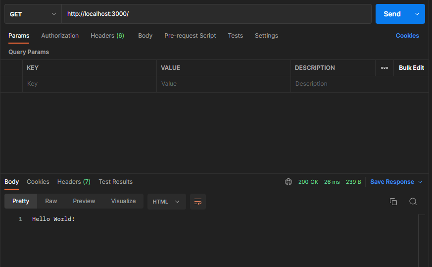
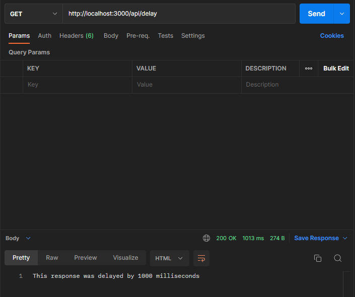

# Thursday February 16, 2023

## Express.JS Core Understanding

1. Read about the Chain of Responsibility design pattern here.

2. Express JS Hello World:

- Create a new Node.JS project using NPM.

- Install Express.JS as an external dependency in your project following this guide.

- Create an Express.JS Hello World application following this guide.

You can find the solution [here](./hello_world/)



## Forest Gump Ping-Pong API

Create a simple REST API with which you can play ping-pong.

- Use Express JS to build the API.
- Use any port you want for the API.
- The API has to be able to respond to the "ping" request with the "pong" message.
- Use `/api/buba-gump` as the root route for the API.
- Make sure your API responds to the request using JSON e.g.:
  ```javascript
  {
    "message": "pong"
  }
  ```
- Use Postman to test your API.
- Optional but desirable, make your API capable of responding to any player move:
  - If the user makes the "ping" move, your API should respond with "pong".
  - If the user makes the "pong" move, your API should respond with "ping".

### Solution
You can find the solution [here](./Forrest%20Gump%20Ping-Pong%20API/)


---

## Deployed Response API ⏳

Create a simple REST API that receives a request containing a number that represents a delay in milliseconds. The API should respond to the request after the delay specified in the request has expired.

### API Requeriments:

- Use Express JS to build the API.
- Use any port you want for the API.
- The API should use route parameters to get the desired delay:

  ```bash
    # Request example
    # Here 3000 indicates a delay of 3000 milliseconds
    http://localhost:3000/api/delay/3000
  ```

- Your API should have just one request handler.
- You can send any response you want after the delay has expired.
- If no delay is provided in the request, the API should use 1000 as default.

### Solution

You can find the code solution [here](./API_Response/)


