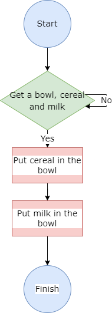

# Week 2
## Monday, November 28, 2022
### Logic problem

#### Description

The teacher asks his 5 students if they studied mathematics yesterday.

Alice: "Nobody studied math yesterday".<br>
Bob: "1 person studied math yesterday".<br>
Charlie: "2 people studied math yesterday".<br>
Dan: "3 people studied mathematics yesterday".<br>
Eva: "4 people studied mathematics yesterday".<br>

The teacher knows that only those who studied would be telling the truth and those who didn't would be lying. Who is telling the truth?

#### Solution

```
Bob is telling the truth.
```
---
### Which comes first, cereal or milk?

#### Description
Create an algorithm to prepare a bowl of cereal with milk. Represent the result in pseudocode and in a flowchart.

#### Solution
The algorithm is the following:
```
1. Start
2. Get a bowl, cereal and milk.
3. Put cereal in the bowl.
4. Put milk in the bowl.
5. Finish.
```

The pseudocode of the algorithm is the following:
```
si bowl, cereal, milk diferente de vacío entonces
    insertar cereal en bowl
    insertar leche en bowl
de lo contrario
    encontrar bowl, cereal, leche
    insertar cereal en bowl
    insertar leche en bowl
fin si
```

The flowchart of the algorithm is the following:<br>
