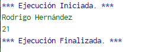
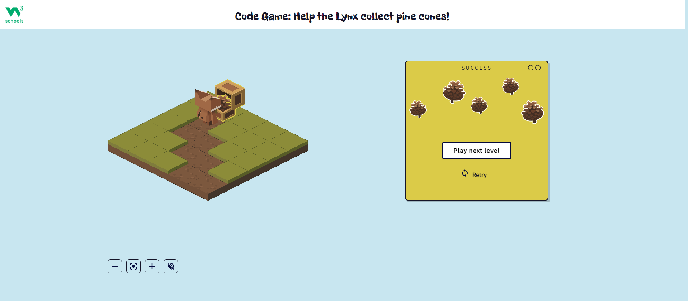
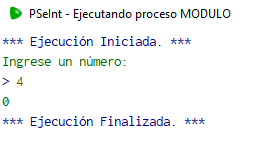
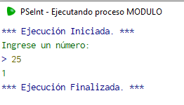
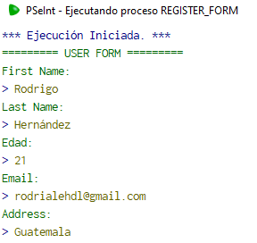
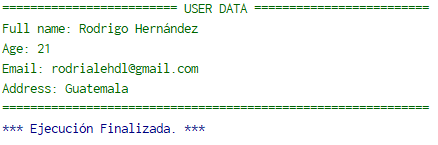

# Week 2
## Monday, November 28, 2022
### Logic problem

#### Description

The teacher asks his 5 students if they studied mathematics yesterday.

Alice: "Nobody studied math yesterday".<br>
Bob: "1 person studied math yesterday".<br>
Charlie: "2 people studied math yesterday".<br>
Dan: "3 people studied mathematics yesterday".<br>
Eva: "4 people studied mathematics yesterday".<br>

The teacher knows that only those who studied would be telling the truth and those who didn't would be lying. Who is telling the truth?

#### Solution

```
Bob is telling the truth.
```
---
### Which comes first, cereal or milk?

#### Description
Create an algorithm to prepare a bowl of cereal with milk. Represent the result in pseudocode and in a flowchart.

#### Solution
The algorithm is the following:
```
1. Start
2. Get a bowl, cereal and milk.
3. Put cereal in the bowl.
4. Put milk in the bowl.
5. Finish.
```

The pseudocode of the algorithm is the following:
```
si bowl, cereal, milk diferente de vacío entonces
    insertar cereal en bowl
    insertar leche en bowl
de lo contrario
    encontrar bowl, cereal, leche
    insertar cereal en bowl
    insertar leche en bowl
fin si
```

The flowchart of the algorithm is the following:<br>


---
## Tuesday, November 29, 2022
### Print my name

The pseudocode of the algorithm is the following:
```python
Algoritmo my_Name
	Imprimir 'Rodrigo Hernández'
FinAlgoritmo
```

The result of the algorithm is the following:


You can also view the pseudocode in PSeInt by opening the PSeInt file: [my_Name](./my_Name.psc)

---

### Print my name & age

The pseudocode of the algorithm is the following:
```python
Algoritmo my_Name_and_age
	Imprimir 'Rodrigo Hernández'
	Imprimir '21'
FinAlgoritmo
```

The result of the algorithm is the following:



You can also view the pseudocode in PSeInt by opening the PSeInt file: [my_Name_and_age](./my_Name_and_age.psc)

---

## Wednesday, November 30, 2022

### Algorithm game

I complete 15 levels of this [game](https://www.w3schools.com/codegame/).

This is my progress:



---

### Mod

#### Description

The challenge for you now is to create a PSeInt program that will receive a number from the user and add the mod operator using the even/odd case ( X % 2 ) where X is the user input.

#### Solution
The pseudocode of the algorithm is the following:
```python
Algoritmo Modulo
	Definir x Como Entero
	Imprimir 'Ingrese un número:'
	Leer x
	Imprimir x%2
FinAlgoritmo
```
The result of the algorithm is the following:
- For even numbers:

- For odd numbers:


You can also view the pseudocode in PSeInt by opening the PSeInt file: [Modulo](./Modulo.psc)

---

### Register Form
#### Description
You are given the task to create a registration form for new users, this form should ask the user for the following information:

- First name
- Last name
- Age
- Email
- Address

At the end of the program, you should print all the information added from the user in a friendly way

#### Solution

The pseudocode of the algorithm is the following:
```python
Algoritmo Register_Form
	Imprimir '========= USER FORM ========='
	Imprimir 'First Name:'
	Leer first_name
	Imprimir 'Last Name:'
	Leer last_name
	Imprimir 'Edad:'
	Leer age
	Imprimir 'Email:'
	Leer email
	Imprimir 'Address:'
	Leer address
	Imprimir '========================= USER DATA ========================='
	Imprimir 'Full name: ' + first_name + ' ' + last_name
	Imprimir 'Age: ' + age
	Imprimir 'Email: ' + email
	Imprimir 'Address: ' + address
	Imprimir '============================================================='
FinAlgoritmo
```

Input:


Output:


You can also view the pseudocode in PSeInt by opening the PSeInt file: [Register_Form](./Register_Form.psc)
