# Week 3
## Monday, December 05, 2022
### Simple Calculator

#### Description
For this challenge you will be performing a simple calculator, this calculator can perform the following operations:

1. Sum (+)
2. Subtract (-)
3. Multiplication (\*)
4. Division (/)

The calculator must ask the user for two numbers, after asking for the two numbers, you must ask for the operation to be performed, keep in mind that you must show the user the options available (+, -, \*, /). The first thing that must be done is to validate that the operation that the user entered is valid, if it is not a valid option, the user must be shown an error message, for example: `⚠️ La operación no es valida` and terminate the program. If the operation is valid, show the message: `Procesando: <OPERACIÓN A REALIZAR>` For, example: if the user has entered the numbers 10 and 15 as well as the operation \*, the message should read: `Procesando: 10 * 15`. After this message the result of the operation must be displayed, following the previous example, the result of operating 10 \* 15 is 150, so the program should return: `Resultado: 150`. Remember to use conditionals to identify which operations you should execute.

#### Solution

The pseudocode of the algorithm is the following:

```python
Algoritmo Calculadora
	Escribir '=====================CALCULADORA====================='
	Escribir  'Ingrese el primer número:'
	Leer numero1
	Escribir 'Ingrese el segundo numero:'
	Leer numero2
	Escribir 'Ingrese una operación (+,-,*,/):'
	Leer signo 
	Si signo == '+' | signo == '-' | signo == '*' | signo == '/' Entonces
		Si signo == '+' Entonces
			total = numero1 + numero2
			Escribir 'Procesando: ', numero1, '+', numero2
			Esperar 1 Segundos
			Escribir 'Resultado: ', total
		FinSi
		Si signo == '-' Entonces
			total = numero1 - numero2
			Escribir 'Procesando: ', numero1, '-', numero2
			Esperar 1 Segundos
			Escribir 'Resultado: ', total
		FinSi
		Si signo == '*' Entonces
			total = numero1 * numero2
			Escribir 'Procesando: ', numero1, '*', numero2
			Esperar 1 Segundos
			Escribir 'Resultado: ', total
		FinSi
		Si signo == '/' Entonces
			total = numero1 / numero2
			Escribir 'Procesando: ', numero1, '/', numero2
			Esperar 1 Segundos
			Escribir 'Resultado: ', total
		FinSi
	SiNo
		Escribir ':( La operación no es valida'
	FinSi
FinAlgoritmo
```

The result of the algorithm is the following:
- Is correct:

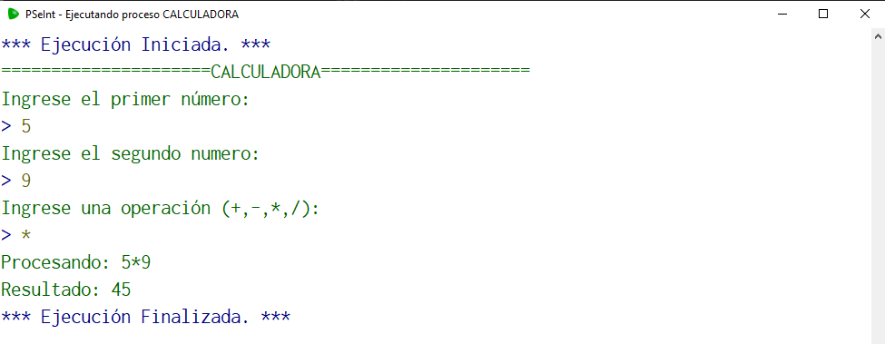

- Is incorrect:

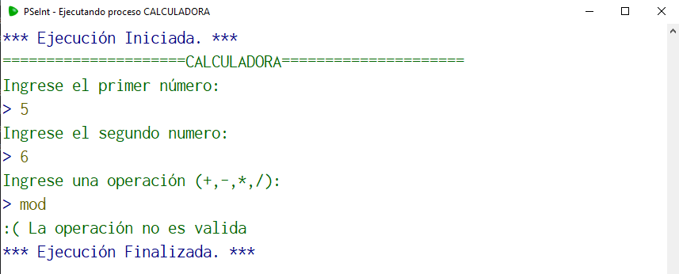

You can also view the pseudocode in PSeInt by opening the PSeInt file: [Calculator](./Code/Calculadora.psc)

---

### Special number

#### Description
You must create the code that follows the following logic, if the given number is 100, take this number as special and show the following message: "This is a special number!", but if the number is less than 1000, multiple of 10 and different from 100, you must show the following message: "This number is almost special". if none of the given conditions are met show the following message: "Just a regular number". Another developer was trying to program the logic, but apparently couldn't, you need to fix the code to work properly

This was the code from the developer

```python
Algoritmo specialNumber
	Leer n
	Si n == 100 Entonces
		Imprimir 'This is a special number'
	FinSi
	Si n < 1000 Entonces
		Imprimir ''
	SiNo
		Imprimir 'Just a regular number'
	FinSi
	Si n % 10 == 0 Entonces
		Imprimir 'This number is multiple of 10'
	FinSi
FinAlgoritmo
```

#### Solution

The correct pseudocode of the algorithm is the following:

```python
Algoritmo specialNumber
	Leer n
	Si n == 100 Entonces
		Imprimir 'This is a special number'
	SiNo
		Si n <1000 & n%10==0 & n<> 1000 Entonces
			Imprimir 'This number is almost special'
		SiNo
			Imprimir 'Just a regular number'
		FinSi
	FinSi
FinAlgoritmo
```

The result of the algorithm is the following:
- Special number:

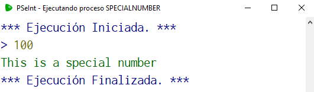

- Almost special number:

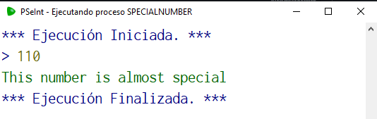

- Regular number:

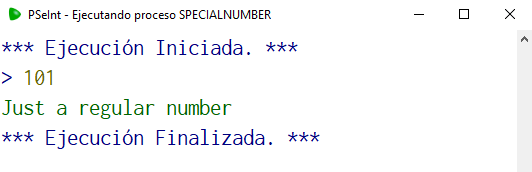

The pseudocode can also be viewed in PSeInt by opening the PSeInt file: [SpecialNumber](./Code/specialNumber.psc)

---
## Tuesday, December 06, 2022
### Simple calculator
#### Description

For this challenge you will be performing a simple calculator using Switch (Segun), this calculator can perform the following operations:

1. Sum (+)
2. Subtract (-)
3. Multiplication (*)
4. Division (/)

The calculator must ask the user for two numbers, after asking for the two numbers, you must ask for the operation to be performed, keep in mind that you must show the user the options available (+, -, *, /). The first thing that must be done is to validate that the operation that the user entered is valid, if it is not a valid option, the user must be shown an error message, for example: ⚠️ La operación no es valida and terminate the program. If the operation is valid, show the message: Procesando: <OPERACIÓN A REALIZAR> For, example: if the user has entered the numbers 10 and 15 as well as the operation *, the message should read: Procesando: 10 * 15. After this message the result of the operation must be displayed, following the previous example, the result of operating 10 * 15 is 150, so the program should return: Resultado: 150. Remember to use Switch (Segun) to identify which operations you should execute.

#### Solution

The pseudocode of the algorithm is the following:

```python
Algoritmo Calculadora_Segun
	Escribir '=====================CALCULADORA====================='
	Escribir  'Ingrese el primer número:'
	Leer numero1
	Escribir 'Ingrese el segundo numero:'
	Leer numero2
	Escribir 'Ingrese una operación (+,-,*,/):'
	Leer signo 
	Segun signo Hacer
		'+':
			total = numero1+numero2
			Escribir 'Procesando: ', numero1, '+', numero2
			Esperar 1 Segundos
			Escribir 'Resultado: ', total
		'-':
			total = numero1-numero2
			Escribir 'Procesando: ', numero1, '-', numero2
			Esperar 1 Segundos
			Escribir 'Resultado: ', total
		'*':
			total = numero1*numero2
			Escribir 'Procesando: ', numero1, '*', numero2
			Esperar 1 Segundos
			Escribir 'Resultado: ', total
		'/':
			total = numero1/numero2
			Escribir 'Procesando: ', numero1, '/', numero2
			Esperar 1 Segundos
			Escribir 'Resultado: ', total
		De Otro Modo:
			Escribir ':( La operación no es valida'
	FinSegun
FinAlgoritmo
```

The result of the algorithm is the following:
- Is correct:


- Is incorrect:


You can also view the pseudocode in PSeInt by opening the PSeInt file: [Calculator](./Code/Calculadora_Segun.psc)

---

### Multi Option Program
#### Description

For this challenge you will create a program with multiple options using Switch (Segun), the options available are the following:

1. Sum two numbers
2. Print the day of the week given the day number
3. Print the length of a given text

This program must have a start menu where the user must select one of the previously described options. When the user selects each of the options, the program will perform the following:

1. Sum. The user enters two numbers and the result of the sum of both is printed
2. Print day of the week. The user enters a day of the week using numbers and the name of the day must be printed. For example, if the number 1 is entered, the program prints the text Lunes.
3. Calculate text length. The user enters a text and the length of the text should be printed. I was able to use the Pseint Longitud function to get the length.
When the user enters an incorrect option, a message should be printed saying that the option is not available.

#### Solution

The pseudocode of the algorithm is the following:

```python
Algoritmo Multi_Option
	Escribir '========= Multi Opcion ==========='
	Escribir 'Opciones Disponibles:'
	Escribir '1. Suma de dos numeros'
	Escribir '2. Imprimir día de la semana'
	Escribir '3. Calcular longitud de texto'
	Escribir 'Ingrese la opcion seleccionada:'
	Leer opcion_usuario
	Segun  opcion_usuario Hacer
		1:
			Escribir 'Ingrese el primer numero:'
			Leer numero_1
			Escribir  'Ingrese el segundo numero:'
			Leer numero_2
			total = numero_1+numero_2
			Imprimir 'El total de la suma es: ', total
		2:
			Escribir 'Ingrese el dia de la semana en numeros (1-7):'
			Leer dia
			segun dia Hacer
				1:
					Imprimir 'Lunes'
				2: 
					Imprimir 'Martes'
				3:
					Imprimir 'Miercoles'
				4:
					Imprimir 'Jueves'
				5:
					Imprimir 'Viernes'
				6:
					Imprimir 'Sabado'
				7:
					Imprimir 'Domingo'
			FinSegun
		3:
			Imprimir 'Ingrese un texto:'
			Leer text
			Imprimir 'La Longitud del texto es:', ConvertirATexto(Longitud(text))
	FinSegun
FinAlgoritmo
```
The result of the algorithm is the following:

- Option 1:

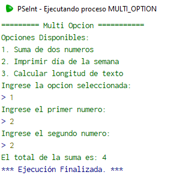

- Option 2:

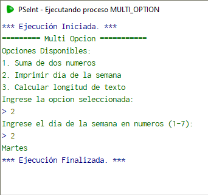

- Option 3:


You can also view the pseudocode in PSeInt by opening the PSeInt file: [Multi Option](./Code/Multi_Option.psc)

---
## Wednesday, December 07, 2022
### Multiplication Tables

#### Description

For this challenge you will create a program to calculate the multiplication tables for a given number using While (Mientras). The user must enter a number and then the multiplication table for the number must be printed.

#### Solution

The pseudocode of the algorithm is the following:

```python
Algoritmo Multiplication_Tables
	Escribir '======= MULTIPLICATION TABLES ======='
	Escribir 'Ingrese la tabla a multiplicar'
	Leer number
	Escribir '@ Tabla de ', number, ' @'
	numbers = 1
	Mientras numbers <= 10 Hacer
		total = number*numbers
		Escribir number, ' * ' numbers, ' = ', total
		numbers = numbers + 1
	FinMientras
FinAlgoritmo
```

The result of the algorithm is the following:

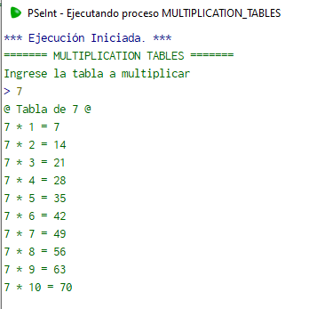

You can also view the pseudocode in PSeInt by opening the PSeInt file: [Multiplication Tables](./Code/Multiplication_Tables.psc)

---

### Simple calculator with Do While

#### Description

For this challenge we are going to use the simple calculator that we made in the challenge 02 but now adding the functionality to perform a calculation again without finishing the program. The program should ask us if we want to use another operation and if the user answers yes then we can perform a new operation. To solve this challenge remember to use Do while (Repetir Hasta Que).

#### Solution

The pseudocode of the algorithm is the following:

```python
Algoritmo Calculadora_Do_While
	continuacion = 'si'
	Escribir '=====================CALCULADORA====================='
	Repetir
		Escribir  'Ingrese el primer número:'
		Leer numero1
		Escribir 'Ingrese el segundo numero:'
		Leer numero2
		Escribir 'Ingrese una operación (+,-,*,/):'
		Leer signo 
		Segun signo Hacer
			'+':
				total = numero1+numero2
				Escribir 'Procesando: ', numero1, '+', numero2
				Esperar 1 Segundos
				Escribir 'Resultado: ', total
			'-':
				total = numero1-numero2
				Escribir 'Procesando: ', numero1, '-', numero2
				Esperar 1 Segundos
				Escribir 'Resultado: ', total
			'*':
				total = numero1*numero2
				Escribir 'Procesando: ', numero1, '*', numero2
				Esperar 1 Segundos
				Escribir 'Resultado: ', total
			'/':
				total = numero1/numero2
				Escribir 'Procesando: ', numero1, '/', numero2
				Esperar 1 Segundos
				Escribir 'Resultado: ', total
			De Otro Modo:
				Escribir ':( La operación no es valida'
		FinSegun
		Escribir 'Deseas continuar con otra operacion ? si/no'
		Leer continuacion
	Mientras Que continuacion == 'si'
FinAlgoritmo
```

The result of the algorithm is the following:


You can also view the pseudocode in PSeInt by opening the PSeInt file: [Simple calculator with Do While](./Code/Calculadora_Do_While.psc)

---

## Thursday, December 08, 2022

### Multiplication Tables with For

#### Description

For this challenge you will create a program to calculate the multiplication tables for a given number using the For(Para) loop. The user must enter a number and then the multiplication table for the number must be printed.

#### Solution

The pseudocode of the algorithm is the following:

```python
Algoritmo Multiplicacion_For
	Escribir "======================= CALCULADORA ====================="
	Escribir "Ingrese la tabla de multiplicar"
	Leer numero_user
	Escribir "@ Tabla de ", numero_user, " @"
	Para i<-1 Hasta 11 Con Paso 1 Hacer
		total = i*numero_user
		Escribir numero_user, " * ", i, " = ", total
	Fin Para
FinAlgoritmo
```

The result of the algorithm is the following:

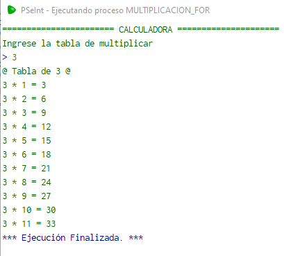

You can also view the pseudocode in PSeInt by opening the PSeInt file: [Multiplication Tables with For](./Code/Multiplicacion_For.psc)

---

### Ascending and Descending Numbers

#### Description

For this challenge we are going to print numbers in ascending or descending order. The user must enter a number, then he must enter if he wants to print the numbers in ascending or descending order. If the user chooses ascending, the numbers will be printed from the number 0 to the number entered, otherwise the numbers will be printed descending from the number entered to the number 0.To solve this challenge remember to use the For(Para) loop.

#### Solution

The pseudocode of the algorithm is the following:

```python
Algoritmo Ascending_Descending
	Escribir "======= Ascending and Descending Numbers ========"
	Escribir "Ingrese un numero"
	Leer number
	Escribir  "Operaciones disponibles:"
	Escribir "1. Imprimir en orden Ascendente"
	Escribir "2. Imprimir en orden Descendente"
	Escribir "Ingrese operacion a ejecutar"
	Leer option
	Segun option Hacer
		1: 
			Para i<-0 Hasta number Con Paso 1 Hacer
				Escribir i
			Fin Para
		2: 
			Para i<-number Hasta 0 Con Paso -1 Hacer
				Escribir i
			Fin Para
	FinSegun
FinAlgoritmo
```

The result of the algorithm is the following:

- Ascending

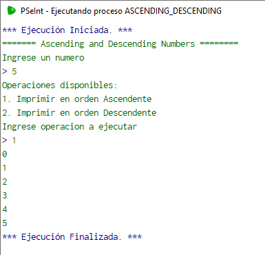

- Descending

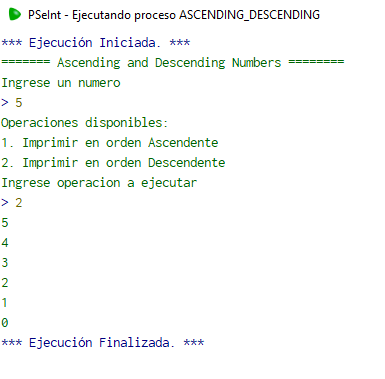

You can also view the pseudocode in PSeInt by opening the PSeInt file: [Ascending and Descending Numbers](./Code/Ascending_Descending.psc)

---

### Greetings

#### Description

For this challenge, you need to create a program that prints a greeting based on an hour entered. The program should do the following:

- Print `Buenos dias!` if the hour is from 0 to 12
- Print `Buenas tardes!` if the hour is from 13 to 18
- Print `Buenas noches!` if the hour is from 19 to 23
- Ask the user if he wants to perform another greeting. If the answer is `Si`, the program must start again.
- At the end of the program, print out the number of times the program has greeted.

#### Solution

The pseudocode of the algorithm is the following:

```python
Algoritmo Greetings
	Escribir "======== Cheers ========"
	continuar = "Si"
	contador_saludos = 0
	Mientras(continuar == "Si") Hacer
		Escribir "Ingrese la hora actual (0-23):"
		Leer hora
		Si hora > 0 & hora <=12 Entonces
			Escribir "Buenos Días!"
			contador_saludos = contador_saludos+1
		FinSi
		Si hora > 13 & hora <=18 Entonces
			Escribir "Buenos Tardes!"
			contador_saludos = contador_saludos+1
		FinSi
		Si hora > 19 & hora <=23 Entonces
			Escribir "Buenos Noches!"
			contador_saludos = contador_saludos+1
		FinSi
		Escribir "Desea continuar? (Si/No)"
		Leer continuar
		Si continuar == "No" Entonces
			Escribir  "Cantidad de saludos realizados: ", contador_saludos
		FinSi
	FinMientras
FinAlgoritmo
```

The result of the algorithm is the following:

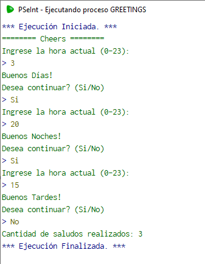

You can also view the pseudocode in PSeInt by opening the PSeInt file: [Greetings](./Code/Greetings.psc)