# Week 4
## Monday December 12, 2022

### Average sales and comission

#### Description

Make a program that asks how many sales the seller had, Once the number of sales is entered, ask for the value of each sale until all are entered, then return as a result the average value of sales, and the commission that the seller will take, If the seller had more than 5 sales, his commission will be 15% of the total value of the sales, if he sold 5 or less, his commission will be only 10%.

#### Solution
The pseudocode for this problem is as follows:

```python
Algoritmo Average_sales_and_comission
	Escribir "Write the total number of sales to enter"
	Leer sales
	contador_ventas = 0
	Para i<-0 Hasta sales-1 Con Paso 1 Hacer
		Escribir "Write the value of the sale number: ", (i+1)
		Leer cantidad
		contador_ventas = contador_ventas + cantidad
	Fin Para
	promedio = contador_ventas/sales
	Escribir "The average sales is: ", promedio
	Si sales > 5 Entonces
		comision = contador_ventas*0.15
		Escribir "The commission received by the seller is: ", comision
	FinSi
	Si sales >= 0 & sales<=5 Entonces
		comision = contador_ventas*0.1
		Escribir "The commission received by the seller is: ", comision
	FinSi
FinAlgoritmo
```

The result of the program is as follows:


You can find the code for this problem [here](./Code/Average_sales_and_comission.psc).

---

### Even or Odd

#### Description

Request a number from 1 to 50, if the number is not between those values, report the error and request it again until you get a valid number, then it shows on the screen all the numbers from 1 to that number, if the number is even it only shows the even numbers, if it is odd it only shows the odd ones.

#### Solution

The pseudocode for this problem is as follows:

```python
Algoritmo Even_Odd
	number = 0
	Repetir
		Escribir "Write a number between 1 and 50"
		Leer number
		Si number>0 & number <= 50 Entonces
			Si number%2 == 0 Entonces
				Para n<-2 Hasta number Con Paso 2 Hacer
					Escribir n
				Fin Para
			SiNo
				Para n<-1 Hasta number Con Paso 2 Hacer
					Escribir n
				Fin Para
			FinSi
		SiNo
			Escribir "invalid number"
		FinSi
	Mientras Que number <=0 | number>50
FinAlgoritmo
```
The result of the program is as follows:


You can find the code for this problem [here](./Code/Even_Odd.psc).

---

## Tuesday December 13, 2022

### Predefined functions

#### Description

The predefined functions of pseint, are codes already integrated in the program to be used when the user requires it, normally they are mathematical functions or functions for text strings.

#### Maths

##### abs

Returns the absolute value of a number.

```python
Algoritmo ABSOLUTE
	Escribir "Absolute of 25: ", abs(25)
	Escribir "Absolute of -25: ", abs(-25)
FinAlgoritmo
```
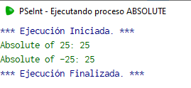

##### trunc

Returns the integer part of a number.

```python
Algoritmo Truncar
	Escribir trunc(256.7892)
FinAlgoritmo
```

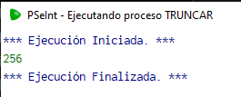

##### redon

Returns the number rounded to the nearest integer.

```python
Algoritmo Redondear
	Escribir redon(256.7892)
FinAlgoritmo
```

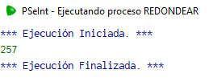

##### azar

The azar(x) function returns a random integer from 0 to x-1. The function aleatorio(x,y) returns a random integer between x and y.

```python
Algoritmo Azar_example
	Escribir azar(100)
	Escribir Aleatorio(500,1000)
FinAlgoritmo
```

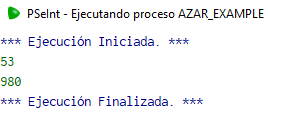

#### Chain

##### longitud

Returns the length of a string.

```python
Algoritmo Azar_example
	Escribir longitud("hola mundo")
FinAlgoritmo
```

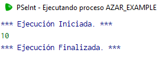

##### mayusculas

Returns a string with all uppercase letters.

```python
Algoritmo Azar_example
	Escribir mayusculas("hola mundo")
FinAlgoritmo
```

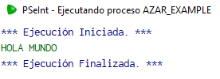

##### minusculas

Returns a string with all lowercase letters.

```python
Algoritmo Azar_example
	Escribir Minusculas("HOLA MUNDO")
FinAlgoritmo
```

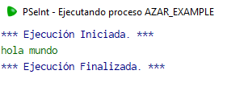

##### subCadena

Returns a substring of a string.

```python
Algoritmo Azar_example
	Escribir Subcadena("Hola Mundo",6,10)
FinAlgoritmo
```

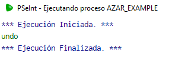


### Full name

#### Description

Make a program that takes a first name and a last name, then returns a string with both values ​​with the first letter uppercase and the rest lowercase.

#### Solution

The pseudocode for this problem is as follows:

```python
Algoritmo Full_name
	Escribir "Escribe tu primer nombre:"
	Leer first_name
	Escribir "Escribe tu apellido"
	Leer last_name
	Escribir Mayusculas(Subcadena(first_name,0,0)), Minusculas(Subcadena(first_name,1,Longitud(first_name)-1)), " ", Mayusculas(Subcadena(last_name,0,0)), Minusculas(Subcadena(last_name,1,Longitud(last_name)-1))
FinAlgoritmo
```

The result of the program is as follows:

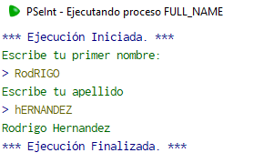

You can find the code for this problem [here](./Code/Full_name.psc).

### Throw dice

#### Description

Make a program that simulates the roll of 2 dice 10 times, and display for each roll the values ​​of the two dice separated by a space, in case the 2 dice throw the same value in addition to the result, add a string to the ending that says "the dice are the same".

#### Solution

The pseudocode for this problem is as follows:

```python
Algoritmo Throw_dice
	contador = 0
	Mientras contador < 10 
		dado1 = Aleatorio(1,6)
		dado2 = Aleatorio(1,6)
		Si dado1 == dado2 Entonces
			Escribir dado1, " ", dado2, " the dice are the same"
			contador = contador+1
		SiNo
			Escribir  dado1, " ", dado2
			contador = contador+1
		FinSi
	FinMientras
	
FinAlgoritmo
```

The result of the program is as follows:

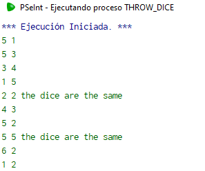

You can find the code for this problem [here](./Code/Throw_dice.psc).

---

## Wednesday December 14, 2022

### Description

Make a program that asks for 5 values ​​and also allows us to know which one is furthest from zero, once obtained it returns that number (the numbers can be negative), showing only the integer part of the number.

#### Solution

The pseudocode for this problem is as follows:

```python
Algoritmo Distance_to_zero
	Escribir "Ingresa un numero"
	Leer numero1
	Escribir "Ingresa un numero"
	Leer numero2
	Escribir "Ingresa un numero"
	Leer numero3
	Escribir "Ingresa un numero"
	Leer numero4
	Escribir "Ingresa un numero"
	Leer numero5
	max = numero1
	Si abs(numero2) > abs(max) Entonces
		max = numero2
		Si abs(numero3) > abs(max) Entonces
			max = numero3
			Si abs(numero4) > abs(max) Entonces
				max = numero4
				Si abs(numero5) > abs(max) Entonces
					max = numero5
				FinSi
			SiNo
				Si abs(numero5) > abs(max) Entonces
					max = numero5
				FinSi
			FinSi
		SiNo
			Si abs(numero4) > abs(max) Entonces
				max = numero4
				Si abs(numero5) > abs(max) Entonces
					max = numero5
				FinSi
			SiNo
				Si abs(numero5) > abs(max) Entonces
					max = numero5
				FinSi
			FinSi
		FinSi
	SiNo
		Si abs(numero3) > abs(max) Entonces
			max = numero3
			Si abs(numero4) > abs(max) Entonces
				max = numero4
				Si abs(numero5) > abs(max) Entonces
					max = numero5
				FinSi
			SiNo
				Si abs(numero5) > abs(max) Entonces
					max = numero5
				FinSi
			FinSi
		SiNo
			Si abs(numero4) > abs(max) Entonces
				max = numero4
				Si abs(numero5) > abs(max) Entonces
					max = numero5
				FinSi
			SiNo
				Si abs(numero5) > abs(max) Entonces
					max = numero5
				FinSi
			FinSi
		FinSi
	FinSi
	Escribir max
FinAlgoritmo
```

The result of the program is as follows:

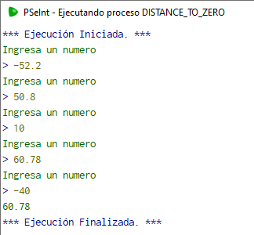

You can find the code for this problem [here](./Code/Distance_to_zero.psc).

### Toss coin

#### Description

From the data we receive first a name and a value, then another name and another value, using the built-in function aleatorio() we simulate the flip of a coin, We must return the name of the winner in capital letters and the value I win, to avoid cheating, if a player puts a value of zero or negative, the opponent automatically wins, in case both cheat, "game canceled" is returned.

#### Solution

The pseudocode for this problem is as follows:

```python
Algoritmo Toss_coin
	Escribir "Ingresa el nombre del primer jugador:"
	Leer name_1
	Escribir "Ingresa el valor:"
	Leer amount_1
	Escribir "Ingresa el nombre del segundo jugador:"
	Leer name_2
	Escribir "Ingresa el valor:"
	Leer amount_2
	Si amount_1 < 1 & amount_2 < 1 Entonces
		Escribir "Game cancelled"
	FinSi
	Si amount_1 < 1 & amount_2 >= 1 Entonces
		Escribir "player wins: ", Mayusculas(name_2), " amount won: ", amount_2
	FinSi
	Si amount_1 >= 1 & amount_2 < 1 Entonces
		Escribir "player wins: ", Mayusculas(name_1), " amount won: ", amount_1
	FinSi
	Si amount_1 >= 1 & amount_2 >= 1 Entonces
		Si Aleatorio(1,2) == 1 Entonces
			Escribir "player wins: ", Mayusculas(name_1), " amount won: ", amount_1
		SiNo
			Escribir "player wins: ", Mayusculas(name_2), " amount won: ", amount_2
		FinSi
	FinSi
FinAlgoritmo
```

The result of the program is as follows:

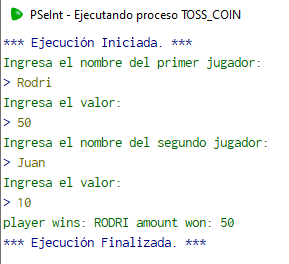

You can find the code for this problem [here](./Code/Toss_coin.psc).

---

## Thursday December 15, 2022

### Total price

#### Description

Create a function called TotalPrice that takes 2 parameters, price and VAT, and returns the price including VAT. if the price exceeds 3000 a 10 percent discount is made on the total price.

#### Solution

The pseudocode for this problem is as follows:

```python
Algoritmo example_TotalPrice
	Imprimir TotalPrice(5000,21)
FinAlgoritmo

Funcion total <- TotalPrice(precio, iva)
	Si precio > 3000 Entonces
		sin_descuento = (precio + (precio*(iva/100)))
		total = sin_descuento-(sin_descuento*0.1)
	SiNo
		total = (precio + (precio*(iva/100)))
	FinSi
FinFuncion
```

The result of the program is as follows:

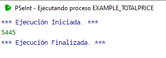

You can find the code for this problem [here](./Code/example_TotalPrice.psc).


### Reverse direction and size

#### Description

Create a function called ReverseDirectionAndSize that takes some text as a parameter and reverses it, eg: "Hello" -> "olleH" and also reverses the letters if they are uppercase to lowercase and if they are lowercase to uppercase, it should do something. like this:

"HelLO" --> "olLEh"

"Leonardo" --> "ODRANOEl"

"Text" --> "TXEt"

#### Solution

The pseudocode for this problem is as follows:

```python
Algoritmo example_ReverseDirectionAndSize
	Imprimir ReverseDirectionAndSize("Hello")
FinAlgoritmo

Funcion reversa <-  ReverseDirectionAndSize(texto)
	Definir reversa Como Caracter
	reversa = ''
	Para i = Longitud(texto) Hasta 0 Con Paso -1 Hacer
		letra = Subcadena(texto,i,i)
		Si letra == Mayusculas(letra) Entonces
			letra = Minusculas(letra)
		SiNo 
			letra = Mayusculas(letra)
		FinSi
		reversa = Concatenar(reversa, letra)
	FinPara
FinFuncion
```

The result of the program is as follows:

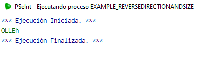

You can find the code for this problem [here](./Code/example_ReverseDirectionAndSize.psc).