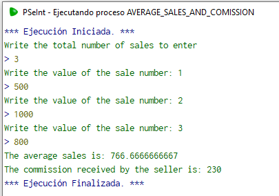
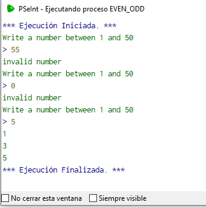

# Week 4
## Monday December 12, 2022

### Average sales and comission

#### Description

Make a program that asks how many sales the seller had, Once the number of sales is entered, ask for the value of each sale until all are entered, then return as a result the average value of sales, and the commission that the seller will take, If the seller had more than 5 sales, his commission will be 15% of the total value of the sales, if he sold 5 or less, his commission will be only 10%.

#### Solution
The pseudocode for this problem is as follows:

```python
Algoritmo Average_sales_and_comission
	Escribir "Write the total number of sales to enter"
	Leer sales
	contador_ventas = 0
	Para i<-0 Hasta sales-1 Con Paso 1 Hacer
		Escribir "Write the value of the sale number: ", (i+1)
		Leer cantidad
		contador_ventas = contador_ventas + cantidad
	Fin Para
	promedio = contador_ventas/sales
	Escribir "The average sales is: ", promedio
	Si sales > 5 Entonces
		comision = contador_ventas*0.15
		Escribir "The commission received by the seller is: ", comision
	FinSi
	Si sales >= 0 & sales<=5 Entonces
		comision = contador_ventas*0.1
		Escribir "The commission received by the seller is: ", comision
	FinSi
FinAlgoritmo
```

The result of the program is as follows:



You can find the code for this problem [here](./Code/Average_sales_and_comission.psc).

---

### Even or Odd

#### Description

Request a number from 1 to 50, if the number is not between those values, report the error and request it again until you get a valid number, then it shows on the screen all the numbers from 1 to that number, if the number is even it only shows the even numbers, if it is odd it only shows the odd ones.

#### Solution

The pseudocode for this problem is as follows:

```python
Algoritmo Even_Odd
	number = 0
	Repetir
		Escribir "Write a number between 1 and 50"
		Leer number
		Si number>0 & number <= 50 Entonces
			Si number%2 == 0 Entonces
				Para n<-2 Hasta number Con Paso 2 Hacer
					Escribir n
				Fin Para
			SiNo
				Para n<-1 Hasta number Con Paso 2 Hacer
					Escribir n
				Fin Para
			FinSi
		SiNo
			Escribir "invalid number"
		FinSi
	Mientras Que number <=0 | number>50
FinAlgoritmo
```
The result of the program is as follows:



You can find the code for this problem [here](./Code/Even_Odd.psc).