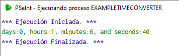
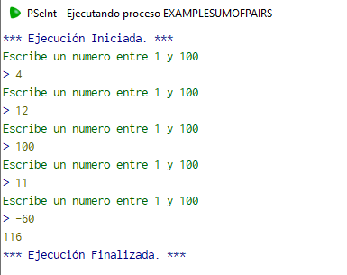
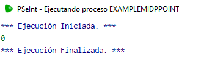
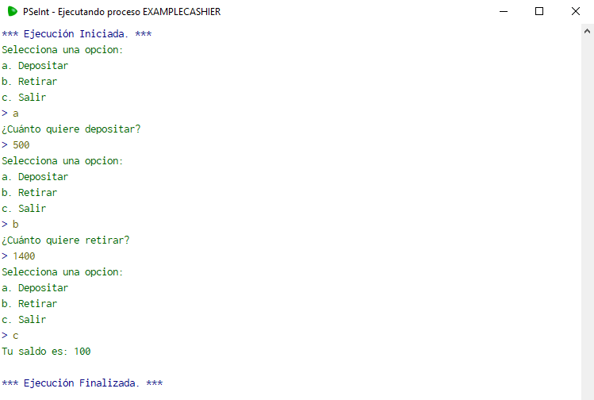
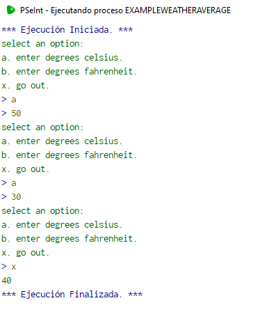

# Week 5

## Monday December 19, 2022

### Time Converter

#### Description

Create a function called timeConverter that receives a positive number of seconds and returns a string based on the number. "Days: 1, Hours: 5, Minutes: 40 and seconds: 5"

4000 --> "days: 0, hours: 1, minutes: 6, and seconds: 4"

40000 --> "days: 0, hours: 11, minutes: 6, and seconds: 4"

150000 --> "days: 1, hours: 17, minutes: 40, and seconds: 0"

#### Solution

```python
Algoritmo exampleTimeConverter
	Imprimir timeConverter(4000)
FinAlgoritmo

Funcion resultado <- timeConverter(segundos)
	segs = segundos % 60
	mins = TRUNC(segundos/60) % 60
	hours = TRUNC(segundos/3600)%24
	days = TRUNC(segundos/86400)
	cadena = 'days:' + ConvertirATexto(days) + ', hours:'+ ConvertirATexto(hours) + ', minutes:' + ConvertirATexto(mins) + ', and seconds:' + ConvertirATexto(segs)
	resultado = cadena
FinFuncion
```

The result of the program is as follows:



You can find the code for this problem [here](./Code/exampleTimeConverter.psc).

---

### Compare distances

#### Description

Create a function called compareDistances that asks for 5 numbers, these can be positive or negative, add the positives with positives and negatives with negatives, the function should return true if there is more distance to 0 with positives or false if the distance is greater with negatives .

4, 12 , 100, 8, -60 --> true

40, 120 , 10, -80, -91 --> false

#### Solution

```python
Algoritmo ComparaDistancias
	Imprimir CompararDistancias()
FinAlgoritmo

Funcion respuesta <- CompararDistancias()
	contador = 0
	contador_positivos = 0
	contador_negativos = 0
	Mientras contador< 5 Hacer
		Escribir "Escribe un numero:"
		Leer num
		Si num < 0 Entonces
			contador_negativos = contador_negativos + num
		SiNo
			contador_positivos = contador_positivos + num
		FinSi
		contador = contador+1
	FinMientras
	Si contador_positivos > ABS(contador_negativos) Entonces
		Escribir "hi"
		respuesta = Verdadero
	SiNo
		respuesta = Falso
	FinSi
FinFuncion
```

The result of the program is as follows:


You can find the code for this problem [here](./Code/ComparaDistancias.psc).

---

## Thuesday December 20, 2022

### Sum of pairs

#### Description

write a function called sumOfPairs that asks for a number from 1 to 100 indefinitely, if a negative number or greater than 100 is entered, it stops asking for more numbers and returns the sum of all the even numbers entered.

4, 12 , 100, 11, -60 --> 116

40, 121 --> 40

#### Solution

This is the code for the problem:

```python
Algoritmo exampleSumOfPairs
	Imprimir sumOfPairs()
FinAlgoritmo

Funcion number <- sumOfPairs()
	num = 0
	n = 0
	Repetir
		Escribir "Escribe un numero entre 1 y 100"
		Leer n
		Si (n>=0 & n<=100) & n%2 == 0 Entonces
			num = num + n
		FinSi
	Mientras Que n>=0 & n<=100 
	number = num
FinFuncion
```

The result of the program is as follows:



You can find the code for this problem [here](./Code/exampleSumOfPairs.psc).

---

### Mid point

#### Description

Write a function called midpoint that given 2 values ​​(can be negative) does not return the value of the midpoint between them

-50,50 --> 0

40, 80 --> 60

#### Solution

This is the code for the problem:

```python
Algoritmo exampleMidpPoint
	Imprimir midPoint(-50,50)
FinAlgoritmo

Funcion resultado <- midPoint(num1,num2)
	Si num1>0 & num2>0 Entonces
		resultado = (num1+num2)/2
	SiNo
		resultado = 0
	FinSi
FinFuncion
```

The result of the program is as follows:



You can find the code for this problem [here](./Code/exampleMidpPoint.psc).

---

## Wednesday December 21, 2022

### Cashier

#### Description

create a function called "cashier" that pretends to be a panel of a bank should display the text: "select an option: a. to deposit. b. withdraw. c. go out." and have a value called balance that will return when finished and will print it on the screen, its initial value will be 1000. You must repeat the menu until you select the option 'c'

if we select 'a' it invokes another function called 'deposit' that will display a text on the screen that will say 'how much do you want to deposit:' it will add that value to the balance and end the function.

if we select 'b' it invokes another function called 'withdraw' that will display a text on the screen that will say 'how much do you want to withdraw:' it will subtract that value from the balance and end the function.

"select an option: a. to deposit. b. withdraw. c. go out."

a -->

"how much do you want to deposit:"

500 -->

"select an option: a. to deposit. b. withdraw. c. go out."

b -->

"how much do you want to withdraw:"

1400 -->

"select an option: a. to deposit. b. withdraw. c. go out."

c -->

100

#### Solution

This is the code for the problem:

```python
Algoritmo exampleCashier
	Imprimir cashier()
FinAlgoritmo

Funcion number <- cashier()
	saldo = 1000
	opcion = "d"
	Mientras opcion <> "c" hacer
		Escribir "Selecciona una opcion:"
		Escribir "a. Depositar"
		Escribir "b. Retirar"
		Escribir "c. Salir"
		Leer opcion
		Si opcion == "a" Entonces
			saldo = saldo + depositar()
		FinSi
		Si opcion == "b" Entonces
			saldo = saldo - retirar()
		FinSi
	FinMientras
	Escribir "Tu saldo es: ", saldo
FinFuncion

Funcion salida <- depositar()
	Escribir "¿Cuánto quiere depositar?"
	Leer salida
FinFuncion

Funcion salida <- retirar()
	Escribir "¿Cuánto quiere retirar?"
	Leer salida
FinFuncion
```

The result of the program is as follows:



You can find the code for this problem [here](./Code/exampleCashier.psc).

---

### Weather average

#### Description

write an algorithm that loops indefinitely until 'x' is entered which will calculate an average of the weather, note that for each value entered it should ask if it is fahrenheit or celsius, then ask for the value. add everything up and divide by the number of values ​​entered. The result must be returned in celsius, have a function that, in case fahrenheit is entered, transforms it to celsius in order to add them.

#### Solution

This is the code for the problem:

```python

Algoritmo exampleWeatherAverage
	count = 0;
	total = 0;
	Repetir
		Imprimir "select an option:";
		Imprimir "a. enter degrees celsius.";
		Imprimir "b. enter degrees fahrenheit.";
		Imprimir "x. go out.";
		leer option
		Si option = "a" | option = "b" Entonces
			leer degree
			count = count + 1;
		FinSi
		Si option = 'a' Entonces
			total = total + degree;
		FinSi
		Si option = 'b' Entonces
			total = total + fahrenheitToCelsius(degree)
		FinSi
	Mientras Que option = "a" | option = "b"
	Imprimir total / count;
	
FinAlgoritmo

Funcion celsius <- fahrenheitToCelsius (fahrenheit)
	Definir celsius Como Real;
	celsius = (fahrenheit - 32 ) / 1.8
Fin Funcion

```

The result of the program is as follows:



You can find the code for this problem [here](./Code/exampleWeatherAverage.psc).

---

## Thursday December 22, 2022

### If

#### Description

Create an if statement with the JavaScript syntax

#### Solution

```JavaScript
//Verifica la edad de una persona
let edad = 18;

if(edad >= 18){
	console.log("Eres mayor de edad");
else{
	console.log("Eres menor de edad");
}
```
---
### While

#### Description

Create a while loop statement with the JavaScript syntax

#### Solution

```JavaScript
//Imprime los numeros del 1 al 10
let contador = 1;

whilr(contador <= 10){
	console.log(contador);
}
```

---

### For

#### Description

Create a for loop with the JavaScript syntax

#### Solution

```JavaScript
//Imprime los numeros del 1 al 10

for(let i = 1; i <= 10; i++){
	console.log(i);
}
```